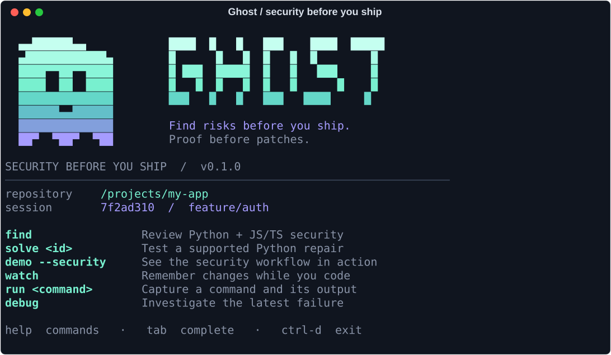

# Ghost 👻

**Find security risks before you ship. Test repairs before you apply them.**


Ghost is a local-first security review CLI for developers. It remembers the file changes and commands you explicitly record, checks Python and JavaScript/TypeScript source before you push, reproduces configured cross-user access failures, and tests proposed changes in isolated Git worktrees. You approve changes to your project.

**Python 3.12+ · macOS / Linux · CLI + interactive REPL · No API key needed for security checks**

[Security workflow](#security-workflow) · [Get started](#get-started) · [Try a security demo](#see-it-work) · [Commands](#commands) · [Architecture](#how-it-works) · [Safety](#safety-and-local-data)

## Security workflow

```bash
# While you develop — optional, explicit capture
ghost watch                       # file changes; leave running in another terminal
ghost run "python -m pytest -q"    # record this command and its output

# Before you push
ghost scope                     # inspect Git-visible scan candidates and blind spots
ghost find
ghost findings --id <finding-id>

# Optional: prove a cross-user access failure on a configured local route
ghost auth --init                  # edit private .ghost/auth.json for your app
ghost auth --check                # validate the local contract without running app code
ghost find --auth                 # send owner and other-user GET requests
ghost auth --prepare-candidate    # edit private .ghost/candidate.py or candidate.cjs
ghost auth --candidate            # test the proposal in fresh isolated worktrees

# Test a supported Python repair, then review the approval prompt
ghost solve <finding-id> --tests "python -m pytest -q"
ghost solution                    # inspect saved proof and patch
ghost find                        # fresh review after applying a change
```

The same commands work in `ghost repl`. `find` also works without a watch session.
Ghost records **only commands run through `ghost run` or REPL `run`**. It does not
watch every terminal, intercept shell history, or silently collect arbitrary logs.
Recent session context shows changed-path and failed-command counts from the last
200 events. Failures are context, not proof of a vulnerability; `failures` and
`debug` retain the existing runtime-debugging workflow.

### What `find` checks today

- **Python:** [Bandit](https://bandit.readthedocs.io/en/latest/) checks risky patterns
  including evaluation, deserialization, shell execution, disabled TLS verification,
  weak hashes, and possible hardcoded credentials.
- **JavaScript/TypeScript:** [Semgrep](https://semgrep.dev/) runs four bundled Ghost
  rules for `eval`, dynamic `Function` construction, selected CommonJS shell-exec
  forms, and `rejectUnauthorized: false`. This initial coverage is deliberately
  small: it does not trace application-wide data flow or every import alias.
- **Evidence:** locations, rule/CWE IDs, scanner confidence, file hashes, engine
  versions, scan completeness, and session context are saved in local SQLite.
  Static matches remain **suspected**, including after a separate repair succeeds.

Default static scans run offline against disposable source snapshots under OS confinement.
They do not import project code, call an LLM, download rules, or contact a live
application. The optional `--auth` check **does execute local project code** in
a confined worktree. Repository scanner configuration and inline `nosec`/`nosemgrep`
suppressions are ignored. Semgrep metrics and version checks are disabled.
Source excerpts and potentially credential-bearing scanner messages are omitted
from saved findings. Paths and hashes remain in local reports.

Scope: tracked and non-ignored untracked `.py`, `.js`, `.jsx`, `.ts`, `.tsx`, `.mjs`,
`.cjs`, `.mts`, and `.cts` files, excluding standard build/dependency directories
and credential paths. Per engine: 1,000 files, 512 KB per file, 16 MB total source,
1 MB output, default 120-second timeout (`--timeout`, up to 600). Git inventory
operations are outside that scanner timeout. Inventory and hashes are checked
again before completion. Reported parse failures, unreadable selected files,
skipped coverage, timeouts, or disabled confinement cannot produce a clean result.

`ghost scope` shows Git-visible Python and JS/TS candidates, known unreviewed
source, excluded, unreadable and over-budget paths, and deleted tracked paths. It reads
candidate source safely without importing it, and does not run a scanner or save
an audit. Terminal output shows up to 20 paths per group; `--json` lists all of
them. Gitignored files are not enumerated. Use `ghost find` for actual scan
coverage and findings; a scope inventory is not a security verdict.

`find --json` exports the complete record. Exit **0** means no findings in the
completed, declared scope; **1** means static candidates or confirmed configured access failures need review; **2** means
incomplete/blocked scanning or no supported source. Other languages remain outside
coverage even if selected checks complete. `audit` retains the Python-only scan.
`findings` reads the latest saved scan, including incomplete runs, and displays
at most 20 cards by default. Use `--severity high --limit 10` to focus the cards,
`--id` for one or `--json` for all. Filtering retains the full audit's coverage,
severity totals and authorization results; an empty filter does not mean a clean
scan. Filters cannot be combined with `--id` or `--json`. IDs change when their source
hash changes. No result certifies an application safe to deploy.

### Check cross-user access locally

`ghost auth --init` creates an ignored, private `.ghost/auth.json` example. Set
the local app module or handler, a resource path, **fake** headers for its
owner and another user, and a synthetic `protected_marker` present in the
owner's response. Run `ghost auth --check` to validate the contract and local
app source without importing or running project code. `ghost auth --check --json`
provides the same limited preflight for scripts. It does not prove the app can
start or that access is safe. `ghost find --auth` runs local GET requests for
the owner and another user in a disposable Git worktree. It records the case
name, path, HTTP statuses,
verdict and two booleans indicating whether the marker appeared. Response
bodies and the marker are not saved in the audit. If the other user receives
the protected marker, Ghost reports a **confirmed failure against that contract**,
even if the response says HTTP 403. A denial requires both an expected
401/403/404 and no marker. If the owner does not receive the marker, or the
other user gets an unexpected response without it, the check is inconclusive
and exits 2. Existing contracts need `protected_marker` added to every case;
`ghost auth --init` shows the current format.

Ghost repeats the configured requests in the opposite actor and case order in
a fresh worktree. If statuses or protected-content observations change, that
case is inconclusive and the report explains why. The same check runs on a
proposed fix before Ghost calls it verified. This catches order-sensitive local
handlers; it does not prove independence from all application state.

Two adapters are supported: Python ASGI apps (`module:app`, with project packages
available through `--auth-python PATH`) and a local CommonJS request handler
(`file.cjs:handle`). This is a local contract, not a crawler or general Express
adapter. It does not start a server, execute lifespan hooks, test live URLs, or
discover routes automatically. The CommonJS handler should return `{status, body}`
with a string, Buffer or JSON-serializable body. Node.js is needed for that adapter.

To test a proposed fix, run `ghost auth --prepare-candidate`, edit the private
`.ghost/candidate.py` or `.ghost/candidate.cjs`, and run `ghost auth --candidate`
(equivalent to `ghost find --auth --candidate`). Ghost repeats the vulnerable
baseline and runs the proposed file in **separate fresh worktrees**. A candidate
is verified only if a confirmed baseline is blocked in every configured case
while owners still get their expected status and protected content. The real
app remains unchanged; the two order checks for both baseline and candidate use
four disposable worktrees in total. This may take longer than an ordinary scan.
The report records the proposed file's SHA-256 hash, and the command still exits
1 while that vulnerable app is present. Review and apply
the change yourself, then rerun `ghost find --auth` on the updated checkout.
See [runnable Python and JS examples](examples/security_auth/README.md).

Only use synthetic accounts in this configuration. `.ghost/` is ignored by Git,
but Ghost's local OS sandbox is not a strong containment boundary for malicious
project code. Review the app before executing its authorization contract. A
passing case proves only the configured route and actors; it cannot certify the
application safe to deploy.

### Python repairs first

`solve` currently has **one conservative recipe**: a standalone Python function
whose body is `return eval(value)` and whose intended API is literal parsing
(Bandit B307). Complex modules, executable annotations/defaults, shadowed names,
and other findings receive an explicit unsupported result. JS/TS fixes are next.

The repair must pass all of these gates:

1. Finding matches the current file hash; OS confinement is active.
2. Existing project tests pass and collect at least one test, without skipped cases.
3. A trusted helper-level probe demonstrates that the original parser evaluates
   a harmless function call. It also checks three legitimate literal inputs.
4. A minimal `ast.literal_eval` patch in a worktree rejects the function call and
   preserves those literal inputs.
5. The same project test command passes with the same count; project files remain
   as expected; a Python rescan removes the target finding.
6. The developer checkout is unchanged since verification. Only then is application
   offered. Interactive approval defaults to No; noninteractive runs leave files
   untouched unless the user explicitly supplies `--apply`.

Use `--tests "python -m unittest discover -v"` or `--tests "python -m pytest -q"`.
Ghost uses its installed Python interpreter; install the project's test dependencies
in that environment. The command runs twice, with two bounded security probes and
one rescan (five processes, at most 120 seconds each). Git and cleanup can add time. Repair validation also limits the project snapshot
to 1,000 regular files, 512 KB each and 16 MB total; larger/unsafe snapshots are
blocked. These limits are checked after worktree creation.
`solution --json` exports the latest persisted repair, including blocked/failed
attempts. Exit 0 means a verified repair is available (or was applied), not that the
whole project is secure; blocked/failed repairs exit 2.

**Limits of this proof:** it establishes helper behavior, not remote reachability
or attacker-controlled input. Replacing `eval` intentionally rejects expressions;
review whether that matches your API. The three probe inputs are recorded in the
trusted probe implementation; no project regression-test file is added yet.
`literal_eval` is not a resource-exhaustion defense. Project tests are trusted code;
counts and summaries do not establish their honesty or coverage. Automatic
authorization discovery, broad tenant isolation, dependency CVEs, deployment configuration, and general automatic
repairs remain launch priorities. Ghost does not promise to find every vulnerability.

## Get started

Requires Python 3.12+ and Git. Experiments also require `sandbox-exec` on macOS or `bubblewrap` (`bwrap`) on Linux. Project test dependencies must already be installed.

Clone the repository and install Ghost as a user tool with **uv**:

```bash
git clone https://github.com/Devesh36/ghost.git
cd ghost
uv tool install --editable . --python 3.12
uv tool update-shell
```

Open a new terminal if uv updated your `PATH`, then try:

```bash
ghost --help
ghost demo --security
```

<details>
<summary>Prefer pip? Install in a virtual environment.</summary>

From the cloned checkout:

```bash
python3.12 -m venv .venv
source .venv/bin/activate
python -m pip install -e .
ghost demo
```

Activate `.venv` in each new terminal, or call `.venv/bin/ghost` directly. Installing into a virtual environment alone does not put `ghost` on your normal shell's `PATH`.

</details>

## See it work

```bash
ghost demo --security
ghost demo --security --keep
```

This runs from any directory with no API key. Ghost creates a temporary repository
with a Python parser, a TypeScript helper, and passing `unittest` tests. It finds
both evaluation risks, reproduces the Python behavior, verifies and applies a
Python repair **only to the sample**, then rescans. The TypeScript finding remains
visible because JS/TS repairs are not supported yet. Every displayed result comes
from a real command; failed verification stops the demo.

`--keep` retains the sample and evidence for inspection. Without it the sample is
removed. The original pricing-regression walkthrough remains available as
`ghost demo` (or `ghost demo --keep`) and exercises the agentic `debug` pipeline.

## Use it in your project

Start inside a Git repository with at least one commit. Activate your project's development environment so its test runner is available.

```bash
ghost repl
```



The startup mascot and serif wordmark materialize, then Ghost shows a daily
workflow: **Code → Review → Verify**. Type `guide` to choose a path:

```text
ghost ❯ guide daily     # Watch edits, record tests, understand failures
ghost ❯ guide review    # Check scope, find risks, inspect evidence and access
ghost ❯ guide repair    # Verify a supported repair, review it, approve and rescan
```

Each guide explains the benefit and the command for every step. It only displays
examples; it never starts a watcher, scan, model request or repair. Replace the
example test runner with your project's command and `<id>` with a real finding
ID. Standalone `ghost guide` works outside a repository too. Try
`demo --security` inside the REPL for a disposable, executable walkthrough.

Type commands without the `ghost` prefix:

```text
ghost ❯ watch
ghost [watching] ❯ run python -m pytest -q
ghost [watching] ❯ failures --output
ghost [watching] ❯ timeline --limit 20
ghost [watching] ❯ find
ghost [watching] ❯ findings
ghost [watching] ❯ solve <id> --tests "python -m pytest -q"
ghost [watching] ❯ solution
```

`watch` records edits in the background while you work in your editor. `run` captures the command's output and exit status. `debug` investigates the latest recorded failure and shows its evidence, patch, and verification results before asking:

```text
Apply verified patch to working tree? [y/N]
```

The default answer is **no**. `debug --apply` supplies explicit approval on the command line. If files change during the investigation, Ghost refuses to apply a stale patch.

### Terminal controls

Type `/` to open the command picker. Use Up/Down to move through every command
and its description; type `/sol` to filter to `solve` and `solution`. Enter inserts
the selected command without executing it, so you can add arguments. Press Enter
again to run it, or Esc to close the picker and restore what you typed. Tab also
completes ordinary command names. Up/Down outside the picker navigates this
session's in-memory input history; nothing is written to shell-history files.

You can also submit `/guide review` or `/scope` directly. Pipes, `TERM=dumb` and
`NO_COLOR` use a plain prompt; submitting `/` there prints the command list.

Ghost's identity pairs an ivory **serif wordmark** with a soft mint mascot and
lavender accents. The terminal logo draws the serif letterforms with cell pixels,
so it works without downloading or installing a font. The SVG product wordmark
uses Georgia, with Times New Roman and the system serif as fallbacks.

Body text and code use the font selected in your terminal's appearance settings.
CLI output cannot select a different font for individual paragraphs. Keep a
monospace body font so commands, tables and borders align. AI replies format
paragraphs, headings, lists and code blocks; terminal controls are escaped and
Markdown links remain inert text. `NO_COLOR` and reduced-motion settings still work.

- `help` shows grouped commands; `help run` shows command options.
- Narrow terminals show a compact command map; use `help <command>` for full
  options. Mistyped commands suggest a close match without echoing arguments.
- `demo` runs the guided example without switching your current project or session.
- `unwatch` stops the background watcher and saves pending events.
- `logo` replays the pixel ghost animation; `clear` redraws the welcome screen.
- **Tab** completes command names; **↑ / ↓** recalls input when readline is available.
- **Ctrl-C** cancels a command or input. **Ctrl-D**, `exit`, or `quit` leaves the REPL.

Input history stays in memory. Set `GHOST_NO_ANIMATION=1` for reduced motion.
Set `NO_COLOR=1` for plain terminal output without styling codes; Ghost still
uses the real terminal width. Animation also turns off for `NO_COLOR`, redirected
output, and basic terminals. Investigation spinners run only while actual work
is in progress.
The watcher, status and timeline screens display repository names, file paths
and recorded commands literally, including terminal control characters in
unusual filenames or command output.

### Prefer separate terminals?

```bash
# Terminal 1
ghost watch

# Terminal 2: after changing code
ghost run "python -m pytest -q"
ghost timeline
ghost debug
```

`ghost run` creates a session automatically when needed. Only commands executed through Ghost are recorded.

## Commands

| Command | What it does |
| --- | --- |
| `ghost find [--json] [--timeout 120]` | Review Python + JS/TS security and recorded session context. |
| `ghost scope [--limit 20] [--json]` | List Git-visible scan candidates, exclusions and blind spots without scanning. |
| `ghost find --auth [--auth-python PATH] [--candidate]` | Add configured local owner/other-user proof; optionally test a proposed fix. |
| `ghost auth --init` | Create a private example authorization contract. |
| `ghost auth --check [--json]` | Validate the contract and app source without executing project code. |
| `ghost auth --prepare-candidate` | Copy the configured app into a private proposed-fix file. |
| `ghost auth --candidate` | Compare original and proposed access behavior in separate worktrees. |
| `ghost solve <id> --tests "python -m pytest -q" [--apply]` | Reproduce, repair and verify a supported Python finding. |
| `ghost solution [--json]` | Inspect the latest security repair, proof and patch. |
| `ghost audit [--json] [--timeout 120]` | Offline Python security review with explicit coverage and failure status. |
| `ghost findings [--severity high] [--limit 20] [--id <id>] [--json]` | Inspect or focus the latest saved security audit. |
| `ghost demo --security [--keep]` | Try mixed-stack findings and a verified Python repair in a temporary sample. |
| `ghost doctor [--json]` | Check prerequisites and execute a sandbox write/network probe. |
| `ghost repl` | Open the interactive prompt with background watching. |
| `ghost guide [daily\|review\|repair]` | Read practical workflows and examples without running anything. |
| `ghost connect [provider] [--model <id>] [--check] [--json]` | Save nonsecret AI settings, inspect them, or test a real connection. |
| `ghost ask [--context] "<question>"` | Ask for advice; optionally share metadata from the latest saved audit. |
| `ghost watch` | Start a session and watch file changes until Ctrl-C. |
| `ghost run <command>` | Execute a command and capture stdout, stderr, timing, and exit status. |
| `ghost retry [--dry-run] [--timeout 120]` | Preview or rerun the latest session's last failed command. |
| `ghost debug [--apply]` | Investigate the latest failure; offer a verified patch. |
| `ghost sessions [--limit 20] [--json]` | Browse saved sessions, newest first, with IDs for history inspection. |
| `ghost status` | Show the latest session, branch, base commit, and event counts. |
| `ghost timeline --limit 20` | Inspect recent edits, commands, and failures. |
| `ghost failures --output` | Read failed commands and the tail of their captured output. |
| `ghost diff` | Show tracked changes against HEAD and list untracked files. |
| `ghost investigations [--session <id>] [--json]` | Browse saved investigations in a session, newest start time first. |
| `ghost report --id <id>` | Read a specific investigation using its full ID or a unique prefix. |
| `ghost report` | Read the latest session's saved investigation. |
| `ghost report --json` | Export that investigation as JSON, or `null` if none exists. |

Use `ghost run --timeout 30 "python -m unittest -v"` to limit a command to 30 seconds. Quoted paths and arguments are supported; shell operators such as pipes and redirects are blocked. A saved report describes its recorded run and does not reverify your current files.
Live `run` and `retry` output escapes terminal control and direction characters,
including ANSI sequences, so a project's output cannot clear Ghost's screen or
create terminal hyperlinks. Newlines and tabs remain readable. Live output is
limited to 64 KB per stream and prints a truncation notice; bounded captured
stdout/stderr are still saved as raw evidence in the local `.ghost/ghost.db`.

### Retry after an edit

```bash
ghost run "python -m pytest -q"
# Edit your code, then inspect the command Ghost will repeat:
ghost retry --dry-run
ghost retry --timeout 30
```

`retry` selects the newest completed command with a nonzero exit code in the
latest session. It revalidates the saved command, runs it in the current repository
with the current environment, streams output, and records a new result linked to
the source session and failure timestamp. A later successful run does not erase
that session's last failure. Older sessions are never searched automatically.
If the source session has ended, execution creates a new session; preview does not.

Like `ghost run`, this is a developer-requested command in your working tree;
it is not an isolated debugging experiment. The default timeout is 120 seconds,
not the original run's timeout. `--dry-run` previews and validates without running
the command or recording run events. Exit codes are the command's exit status,
124 on timeout, 1 when there is no failure to retry, or 2 for invalid/blocked
requests and launch errors. The REPL supports `retry`, `retry --dry-run`, and
`help retry` with the same behavior.

### Revisit an earlier session

```bash
ghost sessions
ghost status --session <id>
ghost timeline --session <id> --limit 30
ghost failures --session <id> --output
ghost report --session <id> --json
```

Use a full session ID or a unique prefix from the list. `--session` also has a `-s` shorthand; without it, these commands inspect the latest session. Ambiguous prefixes produce an error and can be expanded using full IDs from `ghost sessions --json`.

The same commands work inside `ghost repl` without the `ghost` prefix. `help sessions` shows options. Inspecting history does not switch the session used by `watch`, `run`, or `debug`. An **open** session has no recorded end time; this does not establish that its watcher is still running.

The session browser uses a table on wide terminals and cards on narrow ones, honors no-color output, and does not animate. JSON output is an array of session records with full IDs (or `[]` when no sessions exist).

### Concurrent investigations

Only one `ghost debug` or `ghost solve` investigation may run in a checkout at a time, including calls from the REPL. A second attempt exits with code 2 and instructions to wait or cancel the active run in its terminal. The lock stays held through worker cancellation, worktree cleanup, patch approval/application, and final report persistence. Other checkouts can investigate independently; observation and history commands remain available.

Ghost uses a nonblocking OS advisory lock in `.ghost/investigation.lock`. The empty lock file remains after completion; its presence does **not** mean an investigation is active. The OS releases the lock when its holder exits, including a crash. Do not delete or rename the lock file while Ghost is running. This coordinates cooperating Ghost processes; it does not lock your editor or replace source-change checks. Crash recovery for abandoned reports and worktrees is still pending.

### Browse investigation history

```bash
ghost investigations --limit 10
ghost investigations --session <session-id>
ghost report --id <investigation-id>
ghost report --id <investigation-id> --json
```

`investigations` lists the latest session by default. `report --id` searches all sessions in the current repository; add `--session` to restrict it. IDs can be unique prefixes. Invalid or ambiguous IDs fail explicitly. Without `--id`, `report` retains its latest-investigation behavior.

Both commands work inside the REPL. The history screen separates the recorded run state, patch verification/application state, and root cause. Updating an older investigation no longer makes it appear newest. Browsing does not execute experiments or apply a patch. `investigations --json` returns full records (including saved evidence and patches), or `[]` when none exist. Terminal rendering escapes control characters in saved report text; JSON preserves the stored evidence.

### Execution limits and diagnostics

Run `ghost doctor` before your first investigation. It checks Python, Git, optional model configuration, repository context, and the actual OS sandbox boundaries. `ghost doctor --json` emits machine-readable checks and exits nonzero if a check fails.

Investigations default to a 600-second time budget, 24 experiment/verification commands, and a 120-second cap per command. Adjust the first two with:

```bash
ghost debug --time-budget 300 --max-commands 12
```

An exhausted budget stops the investigation and leaves its evidence in `ghost report`. Ctrl-C asks command workers to stop and waits for their worktree cleanup. Cleanup and synchronous Git/filesystem operations may extend past the time budget. Timeouts and signal-terminated experiments are inconclusive evidence, never proof of a root cause. Reports record final state, limits, and command usage.

## How it works

The primary security workflow:

```text
explicit watch/run context + current source snapshot
                       |
                   ghost find
                  /          \
          Python / Bandit    JS/TS / bundled Semgrep rules
                  \          /
             scoped, suspected findings -> SQLite
                       |
                 ghost solve <id>
                       |
           supported recipe + fresh source check
                       |
            isolated worktree + OS confinement
                       |
     passing baseline -> reproduce -> patch -> verify -> rescan
                       |
          source check + explicit user approval

Optional `ghost find --auth` path:

  private owner/other-user contract
             |
  baseline app in fresh worktrees -> compare both request orders
             |
  proposed file in fresh worktrees -> owner succeeds + other denied in both orders
             |
  scoped verdict + candidate hash -> SQLite (real checkout unchanged)
```

The runtime debugging engine remains available through `ghost debug`:

```text
                 FILE EDITS + GIT STATE + COMMAND RESULTS
                                   │
                                   ▼
                         SQLite session timeline
                                   │
                       frozen source snapshot
                                   │
                  ┌────────────────┼────────────────┐
                  ▼                ▼                ▼
                CODE              GIT            RUNTIME
             investigator     investigator     investigator
                  └────────────────┼────────────────┘
                                   ▼
                        3–5 testable hypotheses
                                   │
                                   ▼
                      isolated worktree experiments
                       ├─ reproduce the failure
                       ├─ reverse a suspect file
                       ├─ compare a clean baseline
                       └─ repeat to probe intermittency
                                   │
                                   ▼
                         evidence-based judgment
                                   │
                                   ▼
                     minimal patch → executable tests
                                   │
                                   ▼
                        report → explicit approval
```

The investigators gather bounded evidence through explicit, validated tools. They examine changed code, call sites, Git history, stack traces, and recorded failures concurrently with `asyncio`.

For uncommitted changes, Ghost compares the captured state with `HEAD`. For committed regressions, it uses the session's starting commit or the previous commit. Every experiment starts from the same frozen snapshot or its chosen Git baseline.

**High confidence requires executable evidence:** the failure reproduces, exactly one changed-file reversal passes, and the comparison experiments finish without supporting a competing hypothesis. Inconclusive evidence stops automatic patch generation.

A proposed patch runs through the reproduction command, directly affected and broader tests where discoverable, and configured lint/type checks where available. Model statements never count as proof that a fix works.

### Project layout

Ghost uses the same layered organization as OpenSRE, scoped to a local CLI:

```text
surfaces/          CLI, interactive shell, shared terminal UI, entrypoint
bootstrap/         Session and provider composition
core/              Agent harness, domain types, LLMs, tool dispatch, verification
infrastructure/    Collectors, database, repository operations, safety and sandboxes
config/            Shared defaults and terminal theme
tests/             Unit, adversarial, and real isolated integration tests
examples/          Sample repository generator
assets/            Logo and icon
docs/              Architecture and launch-readiness tracker
```

See [Architecture](docs/ARCHITECTURE.md) for package responsibilities and enforced
import boundaries. The command remains `ghost`. After updating an older editable
install, rerun `pip install -e '.[dev]'` (or `uv tool install --force --editable .`
for a uv tool installation) to refresh its entrypoint. Saved `.ghost/` data is
unchanged.

## Talk to Ghost

Inside `ghost repl`, ask ordinary questions instead of remembering every command:

```text
ghost > what can you do?
ghost > what's the next step before shipping?
ghost > ask --context explain my latest findings
ghost > forget
```

`connect` selects the AI provider. The REPL keeps the last four conversation turns
in memory (also bounded to 24 KB); `forget` clears them. Selecting a provider with
`connect <provider>` also clears history. Conversation is not saved
to SQLite. A basic capabilities guide works without a connection. Other questions
need a connected model. Command typos such as `watc` still get a useful suggestion.

Chat answers are **advice**. Ghost does not execute model-suggested commands or
apply model-suggested patches from a conversation. Run `find`, `auth`, `debug`, or
`solve` explicitly for executable evidence and verified changes. Ordinary questions
send only conversation text and Ghost's capability guide. `ask --context` opts
into sharing the latest saved audit's bounded metadata: scope, counts, up to 20
finding IDs/rules/paths/locations/severities and authorization verdicts. It excludes
source code, command output, scanner messages, headers and private contract markers.
Paths and the words you type may still be sensitive; the privacy heuristic below
is not complete secret detection. A later follow-up can include metadata already
quoted in the model's answer until you use `forget`.

### Connect a provider

In an interactive REPL, type `/connect` or select it from `/`. A provider list
opens with Codex, Claude Code login, Claude API, OpenAI, OpenRouter, Ollama and
compatible APIs. Up/Down browses; Enter inserts a choice; another Enter saves it.
Esc closes the picker. Selecting a provider does not send a request. The setup
card explains missing login, key or model settings; `--check` makes a real request.
Pipes and `NO_COLOR` show the same choices as a plain list through `connect`.

Codex uses your installed CLI login; no extra API key is required:

```bash
codex login                         # if not already signed in
ghost connect codex --check          # sends a real connection-test request
ghost repl
```

Claude has **two separate connection options**. Use your Claude Code login:

```bash
claude auth login                    # sign in outside Ghost
ghost connect claude-code --check    # installed Claude Code; no API key required
ghost repl
```

Both CLI providers accept an optional `--model <id>` and otherwise use their CLI
default. Ghost reuses authentication managed by the installed CLI; it does not
copy login tokens into the repository. Update the CLI if it lacks the required
safety flags. Selecting `claude-code` excludes API-key and alternative-backend
environment variables so they cannot silently override your login choice.

Or connect Claude through the Anthropic API with `claude`. OpenAI uses its native
API too. Choose a model available to your account:

```bash
export ANTHROPIC_API_KEY="your-api-key"
ghost connect claude --model "your-claude-model-id" --check

export OPENAI_API_KEY="your-api-key"
ghost connect openai --model "your-openai-model-id" --check

ghost ask "What can you do?"
ghost connect                       # inspect effective settings without a request
```

OpenRouter, local Ollama and other OpenAI-compatible services are also supported:

```bash
export OPENROUTER_API_KEY="your-api-key"
ghost connect openrouter --model "provider/model-id"
ghost connect ollama --model "your-installed-model"

export MY_PROVIDER_KEY="your-api-key"
ghost connect compatible --model "your-model" \
  --base-url "https://your-provider.example/v1" --key-env MY_PROVIDER_KEY
```

Keys stay in environment variables. `.ghost/llm.json` stores only the selected
provider, model, endpoint and key-variable name with owner-only permissions. Start
the REPL after exporting keys; an already running process cannot see later shell
exports. Ghost reads environment variables and does **not** automatically load
`.env`. `GHOST_PROVIDER`, `GHOST_MODEL`, `GHOST_BASE_URL`, `GHOST_KEY_ENV` and the
legacy `GHOST_API_KEY` override saved settings. If unset, the previous three-variable
OpenAI-compatible setup remains supported:

```bash
export GHOST_API_KEY="your-api-key"
export GHOST_BASE_URL="https://your-provider.example/v1"
export GHOST_MODEL="your-model"
```

No API model is hard-coded. Codex and Claude Code can use their CLI default or an explicit `--model`.
The `LLMProvider` protocol exposes `generate` and `tool_call`; all adapters are also
available to the existing debugging investigators. Security scanners remain
deterministic and do not call a model. Ghost works offline for causal file
identification and small one-hunk reversals; a model can refine hypotheses and
propose smaller debugging edits.

The shared HTTP transport enforces a 60-second total request deadline and 1 MiB
request/response limits. It refuses redirects and compressed responses. Adapters
require complete, nonempty text: `stop` for chat completions, `end_turn` for Claude,
and `completed` for OpenAI Responses (`store: false`). JSON tool replies are
validated by the caller. Errors omit response bodies and endpoint URLs. Remote
configured endpoints require HTTPS; loopback endpoints may use HTTP.

Codex runs `exec` in an empty disposable directory with read-only sandboxing,
ephemeral sessions, user configuration/rules disabled and a restricted inherited
environment. It reuses CLI authentication, requires a completed JSON event stream,
and has a 120-second total deadline and 1 MiB limit per output stream. Timeout,
cancellation and oversized output terminate its process group. It is a trusted
external agent binary: read-only sandboxing does not guarantee that it cannot
read other accessible files or use its own read tools. The conversation prompt
requests no tool use; Ghost never dispatches its answer as commands. Use a current
CLI supporting these flags. Its service retention is governed by that account.

Claude Code uses print mode and a complete successful JSON result. It runs from
an empty disposable directory with built-in tools, slash skills, MCP servers,
Chrome access and customization loading disabled; hooks are disabled explicitly.
Settings sources are empty, safe mode is required and session persistence is off.
Admin-managed policy still applies. This is a trusted external CLI, **not an OS
sandbox**; the installed binary still has access to its account and home directory.
It shares Codex's bounded transport, 120-second deadline and process-group cleanup.
Neither CLI adapter executes commands from chat answers. Claude subscription/API
availability and service retention depend on your account.

Embedded callers can customize `ProviderLimits`; CLI defaults are fixed. Chat
also enforces a provider-independent deadline, an 8 KB question limit and 64 KB
answer limit. The recognized-credential check runs before sending requests.

[`.env.example`](.env.example) lists the settings. Debugging with a configured
provider may send selected code, diffs and failure context to that endpoint. The
guided demo always runs without a model provider. API references:
[OpenAI Responses](https://developers.openai.com/api/docs/guides/text),
[Claude Messages](https://platform.claude.com/docs/en/api/messages/create),
[Codex noninteractive execution](https://developers.openai.com/codex/noninteractive),
[Claude Code CLI flags](https://code.claude.com/docs/en/cli-reference).

### Model evidence privacy

Ghost's file-read, file-list, and code-search tools exclude common credential paths: `.env` and `.env.*` (including examples), `.npmrc`, `.pypirc`, `.netrc`, private-key extensions/names, common cloud credential files, and `.ssh`, `.aws`, `.azure`, `.gnupg`, and `gcloud` directories. Model patch proposals for these paths are refused, including deleted files.

Before built-in investigators call any provider, Ghost checks system text, evidence, and the requested schema for recognized credentials. It checks selected secret-named environment values of at least eight characters (including their JSON-escaped forms), private-key headers, selected API-token formats, and quoted credential assignments. The built-in HTTP provider also checks its explicitly configured API key against message content. Detection blocks the **whole request** and records a content-free reason. Deterministic investigation can continue; no redacted source is used to generate a patch.

This is a conservative heuristic, not a complete secret scanner: false positives are possible, and short, transformed, encoded, or unrecognized secrets can escape detection. Direct calls to a third-party provider outside Ghost's agent boundary are not covered. Local command output, the SQLite history, raw Git tools, and sandbox snapshots are **not** scrubbed by this change. Choose a trusted model endpoint and review sensitive repositories before enabling model calls.

## Safety and local data

Ghost stores session records, events, and investigations under the target repository:

```text
.ghost/
├── ghost.db
├── config.toml
├── logs/
└── worktrees/
```

Add `.ghost/` to your project's `.gitignore`. Observation does not edit repository files. Configure extra watcher exclusions in `.ghost/config.toml`:

```toml
ignore = ["generated", "tmp/*.py"]
```

Common dependency, build, virtual environment, Git, and Ghost directories are excluded by default.

- **Experiments run in disposable Git worktrees.** Ghost detects source changes before applying a verified patch.
- **Single-file patch writes are staged.** Ghost validates every replacement before writing, syncs a temporary file beside the target, and installs it with an atomic rename. Existing permission bits and uniform CRLF line endings are preserved. New files are created with owner-only permissions and cannot overwrite an existing file. Patch targets and their parent paths cannot be symlinks; hardlinked and special files are rejected. Multi-file batches are rejected until transaction recovery is available.
- **Agent operations are logged.** Tool inputs and repository paths are validated; commands have timeouts and bounded captured output.
- **Process confinement limits writes and networking.** macOS uses `sandbox-exec`; Linux uses `bwrap` with a read-only root, writable worktree, and separate network namespace.
- **Commands are screened.** Direct destructive operations, privilege escalation, shell operators, and agent package-install/network commands are blocked.
- **Agent Git reads ignore external helpers.** Agent `git diff`, `show` and `log` disable external diff and text conversion, and agent processes drop inherited `GIT_*` overrides so ambient Git settings cannot redirect a read to another checkout.
- **Applying a project fix requires approval.** Debugging never commits or pushes. The demo creates one baseline commit inside its own generated repository.

The process sandbox allows reads needed by runtimes and installed dependencies. `ghost run` executes your chosen project command in the real repository, so use it with code and commands you trust.

If no supported OS sandbox is available, Ghost refuses agent execution. `GHOST_DISABLE_OS_SANDBOX=1` explicitly opts into **worktree-only isolation**, which does not enforce the OS write or network restrictions. Security `find`, `audit`, `auth`, and `solve` refuse this opt-out.

## Development

```bash
python3.12 -m venv .venv
source .venv/bin/activate
python -m pip install -e '.[dev]'
pytest -q
```

The suite covers persistence, file watching, command capture, tool validation, dangerous-command rejection, sandbox isolation, causal judgment, verification, approval, the REPL, terminal fallbacks, and the guided demo. Integration tests create intentionally broken Git repositories and run real commands; no API key is required. Tests involving experiment execution need the supported OS sandbox.

Brand assets: [wordmark](assets/ghost-logo.svg) · [icon](assets/ghost-icon.svg).

## Current limitations

Launch hardening is in progress. See [the readiness tracker](docs/launch-readiness.md) for completed work, executable checks, and remaining blockers.

Ghost is an early security-focused MVP: broad Python static checks, four JS/TS checks, configured local authorization proof, and one constrained Python repair recipe. The regression debugger remains available.

- Git comparison is bounded to HEAD, a session baseline, or the parent commit; there is no history bisect yet.
- A passing file reversal implicates a file and may not isolate a single edit. Complex or interacting changes can remain inconclusive.
- External services, ignored dependencies/configuration, and nondeterministic environments may prevent reproduction in a worktree.
- Model-generated patches still require local executable verification; a useful patch is not guaranteed.
- Patch installation supports one file at a time (multiple replacement hunks are allowed). It checks for editor changes immediately before installation, but this is not an atomic compare-and-swap with other writers. Crash/power-loss recovery, directory-entry durability, and preservation of ACLs, extended attributes, and ownership are not yet implemented. Interrupted staging may leave a `.ghost-patch-*.tmp` file beside the target; Ghost excludes these files from watcher events.
- The current interface is a CLI and REPL. There is no editor extension, dashboard, shell-history interception, cloud account, or automatic PR workflow.

When the evidence is insufficient, Ghost reports that result and leaves the project's code unchanged.
