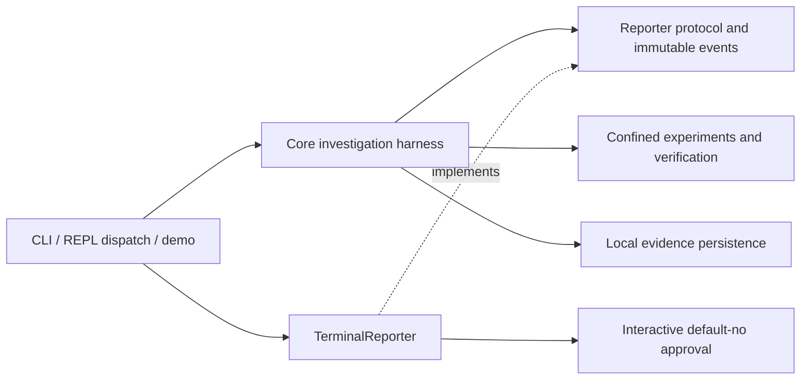

# Ghost architecture

Ghost follows OpenSRE's layered package layout, adapted to local security review
and evidence-driven failure investigation. Ghost's implementations are independent;
see the [source-provenance policy](source-provenance.md).
The console command remains `ghost`; the distribution remains `ghost-debugger`.

```text
.
├── surfaces/
│   ├── entrypoint.py            Console script; composes CLI and REPL
│   ├── cli/
│   │   ├── app.py               Typer commands and command dispatch
│   │   └── commands/            Guided demo and environment diagnostics
│   ├── interactive_shell/
│   │   └── shell.py             REPL, completion, background watching
│   └── shared/                 Terminal reporters, conversation presentation and UI
├── bootstrap/
│   ├── runtime.py              Session and optional provider composition
│   └── providers.py            Provider selection, nonsecret connection settings
├── core/
│   ├── agent_harness/          Investigation loop, reporter contract, execution budgets
│   ├── security/               Typed security audits and evidence states
│   ├── domain/types.py         Sessions, events, hypotheses, patch/evidence models
│   ├── llm/                    Protocol, chat, bounded native/compatible/CLI adapters
│   ├── tool/execution.py       Validated tool requests, dispatch and action logging
│   └── verification/           Discovery of executable verification commands
├── infrastructure/
│   ├── security/               Bounded offline scanner adapter
│   ├── collectors/             File watching, Git diffs, command recording
│   ├── database/               Versioned SQLite repository, migrations and locking
│   ├── repository/             Scoped files, Git subprocesses, patch installation
│   └── safety/
│       ├── guardrails/         Command policy and bounded process execution
│       ├── masking/            Credential-path and model-input checks
│       └── sandbox/            Git worktrees and OS confinement
├── config/                    Shared defaults and terminal palette
├── tests/                     Unit, adversarial, and isolated integration tests
├── examples/                  Executable sample-project creation
├── assets/                    Ghost wordmark and icon
├── site/                      Independent Next.js landing page
└── docs/                      Architecture and launch-readiness evidence
```

## Dependency direction

```text
surfaces/entrypoint
        ├── CLI
        └── interactive shell
                 │
                 v
             bootstrap
                 │
                 v
       core <──> infrastructure
                 │
                 v
               config
```

Higher layers may import any lower layer. `core` and `infrastructure` are peers,
as in OpenSRE: execution infrastructure reads harness budgets and domain types,
while agents use persistence and sandbox services. `config` has no first-party
imports. CLI and REPL do not import each other; their composition belongs in
`surfaces/entrypoint.py`, and shared terminal code belongs in `surfaces/shared`.
`tests/test_architecture.py` checks these boundaries, including function-local
imports and references to the retired `ghost.*` source layout.

The core also has no direct imports of Rich, Typer, Click or prompt-toolkit.
Domain models depend only on domain code and external data-modeling primitives;
they cannot import runtime, infrastructure, configuration or surface packages.
Both restrictions are enforced by architecture tests.

Current local tool contracts and dispatch live in `core/tool`, with filesystem,
Git, and process mechanics in `infrastructure`. Add OpenSRE-style `tools/` or
`integrations/` capability packages when actual additional adapters need them;
register them through `bootstrap` instead of importing upward from the core.
The Next.js landing page in `site/` is a separate frontend. It does not call the
local investigation runtime, read project history or expose a scan service.

## Investigation flow

The CLI composes a session, SQLite repository, optional provider, and a
`TerminalReporter`. The harness records a snapshot and runs code, Git, and runtime
investigators concurrently. Typed tool requests collect bounded evidence. The
experimenter compares real command results in separate worktrees; the judge uses
those results to determine whether patch generation is justified. Verification
executes the proposed patch in another worktree. Working-tree application still
requires explicit approval and source-identity checks.

`core/agent_harness/reporting.py` defines the `InvestigationReporter` protocol:
activity scopes, immutable observations and an explicit approval response.
Frozen event payloads contain strings, counts and tuples of frozen rows, not
mutable `Investigation`, `Hypothesis` or verification models. A reporter can
display results without being handed references that can change recorded proof.

`surfaces/shared/terminal/investigation.py` implements that protocol for both CLI
dispatch and the demo. It owns Rich tables, literal metadata handling, motion
preferences, stdin detection and the default-no Typer prompt. REPL commands use
the same composed CLI handler. Progress is passed through the reporter instance;
there is no ambient progress-handler context or console parameter in the core.



Direct Python callers can use `await debug(repo, db, session_id, provider)` for
headless investigation. The default `NullReporter` emits no output, probes no
terminal and declines approval. Pass a reporter for another presentation or
`apply=True` for explicit application after all existing verification gates.
Internal callers that previously passed a Rich console must now wrap it in
`TerminalReporter(console)` at the surface. CLI options and stored evidence
remain unchanged. New patch-application events identify callback approval as
`reporter` and explicit flag approval as `--apply`; old `interactive` records
remain readable without migration.

The harness constructs patch previews from its pinned snapshot and requests
approval only after executable verification and its source check. It checks
budgets and source identity again before applying the patch. Reporter callbacks
are trusted caller code; their execution is not isolated. An observation callback
failure stops the investigation, persists failure state and unwinds its worktrees
and lock rather than applying a patch after a broken review display. This boundary
does not replace OS confinement, patch installation guards or privacy policy.

## Development and migration

`connect` composes providers through `bootstrap/providers.py`. OpenAI Responses,
Claude Messages and compatible endpoints share `core/llm/transport.py`; Codex
uses its installed CLI login in an empty disposable directory with explicit
read-only/ephemeral flags. `core/llm/conversation.py` owns bounded in-memory history
and the model-input/deadline boundary. CLI `ask` and REPL prose share presentation
through `surfaces/shared/conversation.py`. Free-form replies are inert text. `core/llm/actions.py` defines the only accepted
workflow enum; shared chat routing maps it to fixed host-owned argv through an
injected command executor, so CLI and REPL do not import each other. Explicit
local intents execute directly; model proposals require a repository-scoped,
five-minute pending approval. Models cannot supply command arguments. Audit
metadata sharing requires explicit `ask --context` or `--finding` and disables
actions. `fix` uses the existing single-file isolated repair gates with the
user's explicit tests, source-sharing consent and final application approval.
The debugging harness uses the same provider factory and its existing evidence
and patch gates. Static security review and deterministic repairs remain offline.

Install with `pip install -e '.[dev]'` and run `pytest -q`. The wheel explicitly
includes `surfaces`, `bootstrap`, `core`, `infrastructure`, and `config`.
The installed entrypoint is `surfaces.entrypoint:main`; `python -m
surfaces.entrypoint --help` is also supported.

After updating an older editable checkout, reinstall it so its console script
and package paths are refreshed. For a uv tool installation, run
`uv tool install --force --editable .`. Internal Python imports have moved to the
canonical packages above; there are no compatibility forwarding modules under
`ghost/`. CLI commands, environment variables, and `.ghost/` database/worktree
locations are unchanged. SQLite startup now adopts legacy history as schema
version 1 transactionally, preserving its rows and payloads. Future versions and
unrecognized layouts are refused, and every connection checks compatibility.
See [database upgrade and recovery instructions](database-upgrades.md).

## Security review path

`surfaces/cli/commands/audit.py` invokes the scanner adapter in
`infrastructure/security/bandit.py`. It copies selected source bytes through a
bounded, symlink-refusing reader into a temporary directory, runs the installed
Bandit package under OS confinement and Python isolated mode, validates complete
scanner accounting, and checks source identities again. It never imports project
code. `core/security/models.py` keeps every initial finding in the `suspected`
state with `static` evidence. SQLite stores reports separately from debugging
investigations. A debugging regression's verified patch is not implicitly a
verified security fix; security repairs use the separate solve workflow below.


## Security-first entry points

`find` composes `infrastructure/security/review.py` and two bounded scanner
adapters: Bandit for Python and bundled Semgrep rules for JS/TS. Scanner execution
uses disposable source snapshots, separate from application execution. Session
context is a bounded metadata summary; no raw command logs go to scanners.

`core/security/solver.py` owns the initial Python repair gates, using a deterministic
recipe in `repair.py`. Its trusted `infrastructure/security/probe.py` worker first
validates the module shape, then probes the helper under OS confinement. Tests and
patches run in existing worktree infrastructure. A separate `SecuritySolution`
record retains checks and patch state; static findings are never relabeled as
confirmed by implication. The CLI holds the investigation lock through verification,
review, approval and application. JS/TS repairs and application-level exploit
proofs are not implemented yet.

`brief` reads an existing `SecurityAudit` from SQLite. Its shared terminal
renderer summarizes saved evidence and emits bounded Markdown without invoking
scanners, models or patch tools. CLI dispatch, REPL discovery and workflow guides
expose the same command. Baseline access evidence and candidate worktree results
remain separate; summarizing a record cannot promote its evidence state.
