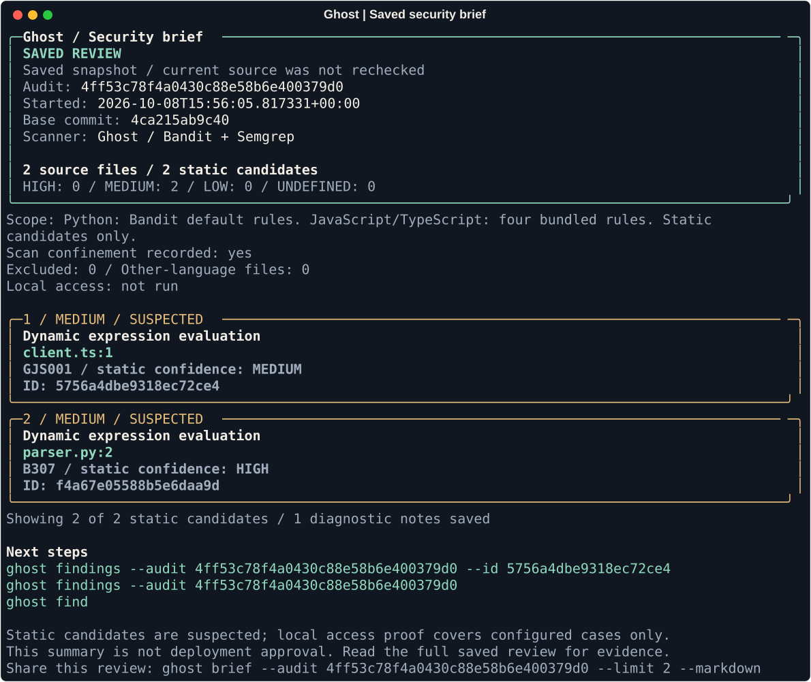

# Prepare a security brief

`ghost brief` turns a saved security review into a compact handoff. It reads
local evidence and makes no scan, model request or change to your source.

```bash
ghost find
ghost brief
ghost brief --limit 10
ghost audits
ghost brief --audit <audit-id>
```

The terminal view shows saved review status, scope, severity totals, the top
static candidates and next commands. HIGH candidates appear first; equal
severities sort by path and line. Limits affect only the candidate list; full
counts and confirmed/inconclusive local access counts remain visible.

The summary labels static findings as suspected, flags incomplete coverage,
and keeps baseline access evidence separate from candidate worktree results.
It never treats a candidate patch as a change to your actual checkout.



Actual saved output from a disposable two-file sample. Both findings are static
leads; local access checks were not run, and this view does not recheck source.

## Export Markdown

```bash
ghost brief --markdown > security-review.md
ghost brief --audit <audit-id> --limit 10 --markdown > earlier-review.md
```

Use this in a release review, issue or teammate handoff. The report includes
audit IDs, finding titles and paths, scope and evidence counts. Review that
metadata before sharing. It omits source content, command logs, session context
and raw diagnostic notes; it is not a general secret scrubber. Repository
metadata is escaped as literal Markdown rather than embedded links or HTML.

Markdown goes to stdout; errors go to stderr. File creation is performed by
your shell's `>` redirection, which can overwrite an existing destination.
In the REPL use `/brief` for the summary; run export redirection from your shell.

## Read the full evidence

The summary limits candidates to five by default (`--limit` accepts 1–50).
Long metadata is abbreviated. The saved record remains unchanged. Use
`ghost findings --audit <audit-id>` or its `--json` form for full details.

`brief` returns 0 when the saved review is read successfully, 1 if no review
exists, or 2 for invalid/ambiguous selection or inspection errors. An incomplete
or historical review can still be read successfully. For an executable scan
result, run `ghost find`; this report is not a deployment approval.
